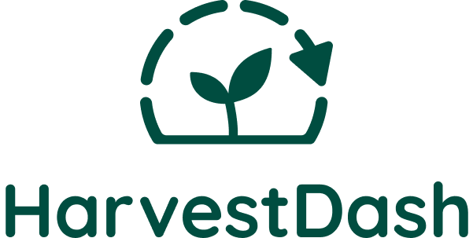

<p align="center">
    
</p>
<h1 align="center">
  HarvestDash Website
</h1>
<h3 align="center">
  Secure Tomorrow&apos;s Harvest Today
</h3>

HarvestDash&apos;s static website powered by [Gatsby](https://www.gatsbyjs.org/) and using [Grommet](https://v2.grommet.io/) and [styled-components](https://www.styled-components.com/) for design.

## 🚀 Quick start

1.  **Clone this repo**

    ```sh
    git clone https://github.com/HarvestDash/static-website/
    ```

1.  **Install dependencies**

    ```sh
    cd static-website/
    yarn
    # or yarn install
    ```

1.  **Start developing**

    ```sh
    yarn start
    ```

1.  **Open the source code and start editing!**

    Your site is now running at `http://localhost:8000`!

    _Note: You'll also see a second link: _`http://localhost:8000/___graphql`_. This is a tool you can use to experiment with querying your data._

    Open the `static-website` directory in your code editor of choice and start developing. Save your changes and the browser will update in real time!
